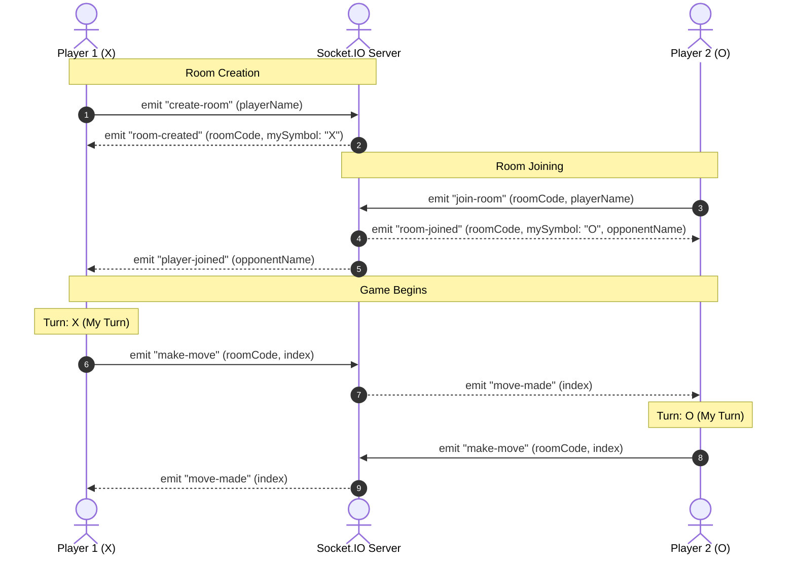

# Tic Tac Toe: Friends Multiplayer Mode Implementation Guide

This guide describes how to extend the existing Tic Tac Toe game to support a real-time **Friends Multiplayer Mode** using **Socket.IO**. It maintains the current visual theme and ensures that the existing offline/local mode continues to function perfectly.

---

## Goal

Add a new **FRIENDS** mode to the Tic Tac Toe game without disrupting the current local/single-player game flow, board design, fonts, or styling.

---

## Current Project Understanding

### 1. Folder Structure
The project is built using React with Vite. The structural layout is as follows:
```text
Tic-Tac-Toe/
├── eslint.config.js
├── index.html
├── package.json
├── vite.config.js
├── public/
└── src/
    ├── App.css
    ├── App.jsx
    └── main.jsx
```

### 2. Main React Components
Currently, the entire application logic is contained in a single main component:
- **`App`** inside [App.jsx](file:///c:/WebDev%20Cohort26/Tic-Tac-Toe/src/App.jsx): Manages the state, board rendering, and game interactions.
- **Helper functions**:
  - `calculateWinner(board)`: Determines if there is a winner by checking all 8 possible winning lines.
  - `getGameState(board)`: Retrieves winner, winning line array, and draw match status.

### 3. State Management
The game state currently lives in [App.jsx](file:///c:/WebDev%20Cohort26/Tic-Tac-Toe/src/App.jsx) via React's `useState` hook:
- `board`: An array of 9 elements representing the cells (`Array(9).fill(null)`).
- `isXTurn`: A boolean flag representing whose turn it is (`true` for X, `false` for O).

### 4. X/O Turn Logic
Inside [App.jsx](file:///c:/WebDev%20Cohort26/Tic-Tac-Toe/src/App.jsx#L11-L22), the `handleClick` function coordinates the turns:
- If a cell is clicked, it checks if it is occupied or if the game is over.
- It updates the board cell to `"X"` or `"O"` depending on the value of `isXTurn`.
- If no winner/draw is detected, it toggles `isXTurn` using `setXTurn(!isXTurn)`.

### 5. Winner/Draw Logic
- Triggered on every render and board state change using `getGameState(board)`.
- It returns `{ winner, winningLine, isDraw }`.
- When a winner is detected, `.winner-cell` classes are applied to highlight the winning path, and a `.winner-tag` span is placed in those cells.
- If the board is full and there is no winner, `isDraw` is set to `true`.
- If `winner || isDraw` is true, `isGameOver` is true, and the `.game-over-overlay` modal appears.

### 6. Reset/New Game Logic
The `resetGame` function resets:
- `board` to `Array(9).fill(null)`
- `isXTurn` to `true`
This is hooked up to the **Reset Game** button and the **Play Again** button inside the game over overlay.

### 7. UI Buttons/Screens
All visual elements are defined in [App.jsx](file:///c:/WebDev%20Cohort26/Tic-Tac-Toe/src/App.jsx) and styled in [App.css](file:///c:/WebDev%20Cohort26/Tic-Tac-Toe/src/App.css):
- **Title**: Styled with `Cinzel` serif font, white text, and thick dark drop shadows.
- **Status Box**: A cream box (`.status`) displaying turn information or game results.
- **Game Board**: A 3x3 CSS Grid container (`.board`) with `.cell` elements.
- **Reset Button**: `.reset-btn` with a dark green gradient background and translation hover animations.
- **Game Over Overlay**: A full-sized modal overlay (`.game-over-overlay`) using backdrop blur, displaying a card (`.game-over-card`) with a canvas-grid background.

### 8. Files to Touch Later
- [App.jsx](file:///c:/WebDev%20Cohort26/Tic-Tac-Toe/src/App.jsx): To integrate the mode switch state, new multiplayer states, Socket.IO listeners, and conditional UI components.
- [App.css](file:///c:/WebDev%20Cohort26/Tic-Tac-Toe/src/App.css): To add styling for the multiplayer menus and setup screen, matching the current theme.
- `package.json`: To install the socket.io client dependency (`socket.io-client`).

### 9. Files Not to Touch Unnecessarily
- [main.jsx](file:///c:/WebDev%20Cohort26/Tic-Tac-Toe/src/main.jsx): Should remain unchanged as it only bootstraps the React app.
- `index.html`: No modifications are needed here unless adding external icons or fonts.
- `vite.config.js`: Unlikely to require changes unless proxy configurations are desired for development.

---

## Multiplayer/Friends Mode Plan

To preserve the default experience, we introduce a **Mode Selection Screen** at the beginning, or a **Friends Mode** toggle.

### Mode Selection UI Flow
1. On page load, the player sees two main options:
   - **Local Play** (offline play against a friend on the same screen, which is the current flow).
   - **Play with Friend** (online multiplayer).
2. Clicking **Play with Friend** switches the interface to the **Friends Setup Screen**.
3. The setup screen asks the player for:
   - **Display Name**: The nickname other players will see.
   - **Room Configuration**:
     - **Create Room Button**: Generates a unique room code and places the player in a waiting room.
     - **Room Code Input & Join Button**: Allows entering an existing code to join another player's room.

```
+------------------------------------+
|            TIC TAC TOE             |
|                                    |
|       +--------------------+       |
|       |     LOCAL PLAY     |       |
|       +--------------------+       |
|                                    |
|       +--------------------+       |
|       |  PLAY WITH FRIEND  |       |
|       +--------------------+       |
+------------------------------------+
```

---

## Socket.IO Architecture

Socket.IO enables real-time, bi-directional communication between clients and the server using WebSockets.

### 1. Project Structure Additions
To build the server component, we will later create a backend folder (e.g., `server/`) containing a node server script:
- `server/server.js`: Node.js server using Express and Socket.IO.
- `src/socket.js`: Client-side Socket.IO initialization and instance helper.

### 2. Room Concept & Rules
- **Rooms**: Abstract channels that sockets can join (`socket.join(roomCode)`). This allows broadcasting events only to the players in that specific room.
- **Max Room Capacity**: Locked to exactly **2 players**. Any third player attempting to join the same room code should receive a `room-full` event.
- **Symbol Assignment**:
  - **Player 1 (Creator)** is assigned **X**.
  - **Player 2 (Joiner)** is assigned **O**.
- **Turn Order**: X always plays first. The turn state begins with X.

### 3. Conceptual Socket Events Diagram


### 4. Details of Socket Events

| Event Name | Sent By | Payload | Purpose |
| :--- | :--- | :--- | :--- |
| `create-room` | Client | `{ playerName }` | Initiates the creation of a new game room on the server. |
| `join-room` | Client | `{ roomCode, playerName }` | Requests to join an existing game room. |
| `room-created` | Server | `{ roomCode, symbol: "X" }` | Confirms the room has been created and assigns player symbol. |
| `player-joined` | Server | `{ opponentName }` | Sent to the room creator to notify them that Player 2 has joined. |
| `room-joined` | Server | `{ roomCode, symbol: "O", opponentName }` | Sent to the joining player confirming success and supplying the host's name. |
| `room-full` | Server | `{ message: "Room is full!" }` | Rejects a join request because 2 players are already in the room. |
| `invalid-room` | Server | `{ message: "Room code not found!" }` | Rejects a join request because the code does not exist. |
| `make-move` | Client | `{ roomCode, index }` | Broadcasts that a player clicked a cell. |
| `move-made` | Server | `{ index }` | Relays the cell clicked to the other player in the room. |
| `reset-game` | Client | `{ roomCode }` | Requests to restart the game board. |
| `game-reset` | Server | *None* | Relays to both players to wipe their local boards and reset turns. |
| `player-disconnected`| Server | *None* | Notifies the remaining player that their opponent left the game. |

---

## What Data Should Be Sent

To prevent synchronization issues and latency-induced glitches, **do not broadcast the entire board array** on every move. Keep events minimal and transactional:

1. **Move Event (`make-move`)**:
   - Send only the **cell index** (e.g. `4`) and **room code**.
   - Each client receives the index and locally runs their board modification logic. Since turn sync is strict, both clients will write the correct symbol.
2. **Reset Event (`reset-game`)**:
   - Send only the **room code** to trigger a clear command.
   - The clients will call their existing, clean `resetGame()` functions locally.

---

## Turn Synchronization Plan

In online multiplayer, we must prevent illegal moves:

1. **Identity Check**: Ensure a player can only click cells if their current turn symbol matches their assigned symbol:
   ```javascript
   const myTurn = (isXTurn && mySymbol === "X") || (!isXTurn && mySymbol === "O");
   ```
2. **Game Ready Check**: Clicks must be locked (`return`) if both players are not connected yet (`isWaiting === true`).
3. **Invalid Spot Check**: Existing locks must remain: cannot click an already filled cell (`board[index] !== null`) or when the game is over.
4. **Action Sequence**:
   - When it is my turn, clicking a cell performs a local move **and** emits a `make-move` event.
   - When a move is received from the opponent via `move-made`, the client modifies the cell index using the opponent's symbol and updates the turn.

---

## UI Integration Plan

The visual style must remain clean and unified:

- **Theme Consistency**: Reuse the colors (e.g., `--cream`, `--paper`, `--ink`, `--jade`), fonts (`Cinzel`, `Poppins`), grid alignments, borders, and shadows defined in the CSS variables.
- **Button styling**: Style all new screens and buttons with existing classes such as `.reset-btn` or custom versions that implement the identical hand-drawn canvas textures and outline shadows.
- **The Setup Modal/Screen**: Can be designed using a layout similar to the `.game-over-card` overlay card, styled with a grid lines background, centered titles, and clean hand-drawn input fields.

```css
/* Example styling approach for the multiplayer input cards */
.friends-setup-card {
  background: linear-gradient(180deg, var(--paper) 0%, var(--paper-deep) 100%);
  border: 4px solid rgba(255, 249, 234, 0.96);
  box-shadow: 5px 5px 0 rgba(45, 48, 40, 0.22);
}
```

---

## State Design

To handle the transition from local to multiplayer, the following state variables should be added in [App.jsx](file:///c:/WebDev%20Cohort26/Tic-Tac-Toe/src/App.jsx):

| State Variable | Type | Default Value | Description |
| :--- | :--- | :--- | :--- |
| `mode` | String | `"local"` | Determines the active screen: `"local"`, `"friends-setup"`, or `"friends-playing"`. |
| `playerName` | String | `""` | Stores the player's nickname. |
| `roomCode` | String | `""` | The active room identifier. |
| `mySymbol` | String | `null` | The symbol assigned to this client (`"X"` or `"O"`). |
| `opponentName` | String | `""` | Stores the connected opponent's display name. |
| `isConnected` | Boolean | `false` | Indicates whether the Socket.IO client is connected to the backend server. |
| `isWaiting` | Boolean | `false` | True if the host is waiting for a second player to join the room. |
| `roomError` | String | `""` | Stores error messages (e.g., "Room code invalid" or "Room is full"). |

---

## File-by-File Implementation Guide

### 1. `src/App.jsx`
You will import your socket service and set up react hooks to listen to socket events.
- **Render structure**:
  - Add a conditional check at the root of `App()`:
    - If `mode === "local"`, render the default Tic Tac Toe view. Add a button titled "Play with Friends" which changes `mode` to `"friends-setup"`.
    - If `mode === "friends-setup"`, render a form collecting Name and offering buttons to "Create Room" or "Join Room" (with Room Code text field). Include a back button to return to `"local"` mode.
    - If `mode === "friends-playing"`, render the main game layout, but adapt status messages to show player names: `"Your Turn (X)"` or `"[Opponent]'s Turn (O)"`.
- **Game Interaction**:
  - Update `handleClick(index)` to check if it's Friends Mode. If so, only run the local board update if `myTurn` is true. Emit the index change via socket to the other player.
  - Update `resetGame()` to check if it's Friends Mode. If so, emit `reset-game` instead of resetting locally immediately. The server will notify both to reset, ensuring synchronization.
- **Effects**:
  - Implement a `useEffect` hook that listens to the socket events (`room-created`, `player-joined`, `room-joined`, `move-made`, `game-reset`, `player-disconnected`, etc.) and modifies the state variables accordingly.

### 2. `src/App.css`
Add styling classes supporting the layout:
- **Card Containers**: A `.setup-container` layout mimicking `.game-over-overlay` to present options cleanly.
- **Inputs**: Hand-drawn text boxes styled with Poppins, dark outlines, and slight cream/paper background.
  ```css
  .sketch-input {
    width: 100%;
    padding: 10px 14px;
    border: 3px solid var(--ink);
    background-color: var(--cream);
    font-family: 'Poppins', sans-serif;
    outline: none;
    box-shadow: inset 2px 2px 5px rgba(0, 0, 0, 0.1);
  }
  ```
- **Labels & Alerts**: Styled error labels matching the current palette.

### 3. Server File (`server/server.js`)
A Node.js backend using Express and Socket.IO. Key duties include:
- Generating unique 6-character room codes (e.g., using random alphanumeric strings).
- Keeping track of active rooms in memory:
  ```javascript
  const rooms = {}; // roomCode => { players: [{ id, name, symbol }], boardState }
  ```
- Listening for `create-room` and creating an entry in the rooms object.
- Listening for `join-room`, verifying that the room exists and has fewer than 2 players, then adding the user.
- Forwarding game clicks (`make-move`) and reset events (`reset-game`) to the opponent inside the room.
- Cleaning up rooms when socket connections disconnect.

### 4. Client Socket Helper (`src/socket.js`)
Avoid initializing Socket.IO inline in React renders. Keep a clean helper:
- Import `io` from `socket.io-client`.
- Maintain a single socket connection instance.
- Provide helper methods like `connectSocket()`, `getSocket()`, and `disconnectSocket()`.

---

## Step-by-Step Build Order

1. **Add Friends Button**: Modify the local play layout in [App.jsx](file:///c:/WebDev%20Cohort26/Tic-Tac-Toe/src/App.jsx) to add a "Play with Friends" button. Link it to set the state `mode` to `"friends-setup"`.
2. **Design the Setup UI**: Create the layout and styles for the Name and Room Code inputs in the React UI, displaying error states if validations fail.
3. **Handle Name Inputs**: Add local validation to make sure names are not blank before allowing room creation or joining.
4. **Create/Join Input logic**: Build the input forms allowing code input. Ensure they toggle waiting loaders (e.g. "Waiting for player to join...").
5. **Set up Socket.IO Server**: Create `server/server.js`, configure Express and `socket.io`, and test starting it on port `3001`.
6. **Establish Connection**: Set up `src/socket.js` to connect to the backend server. Update `App.jsx` to establish connection when switching to setup mode.
7. **Code Room Creation**: Write the backend logic for generating room codes and client-side listeners for `room-created`.
8. **Code Room Joining**: Implement backend check-in logic for checking capacity and connecting player 2. Inform player 1 via `player-joined`.
9. **Implement Symbols**: Program room assignment so Player 1 receives `X` and Player 2 receives `O`. Update client states (`mySymbol`, `opponentName`).
10. **Synchronize Moves**: Hook up `make-move` emissions inside cell clicks. Set up `move-made` listeners to apply moves remotely.
11. **Sync Game Resets**: Update reset operations to run through socket broadcasts, clearing the board for both clients.
12. **Implement Disconnection & Error Boundaries**: Gracefully reset status or show alert dialogues if the opponent leaves.
13. **Refine Edge Cases**: Add validation checks for overlapping moves, fast clicks, and returning to local screen resets.

---

## Edge Cases To Handle

- **Empty Name**: Prevent submission with an alert if a player attempts to play without entering a display name.
- **Empty Room Code**: Block joining if the room code input field is empty.
- **Invalid Room Code**: If the user submits a code that doesn't exist on the server, show a friendly warning message (e.g. `"Room code not found. Please try again."`).
- **Room Full**: If 2 players are already in the room, reject subsequent players with a `"This room is full."` message.
- **Player Disconnected**: If one player exits or closes their tab, notify the other player with an overlay or alert message: `"Your opponent disconnected. Game ended."` and return them to the mode selection screen.
- **Waiting for Opponent**: Show a clear visual indicator (`"Waiting for Player 2 to join... Code: [ROOM_CODE]"`) and keep the game board locked while `isWaiting` is active.
- **Duplicate Clicks / Wrong Turn Clicks**: Ignore cell click events entirely if it is not the client's turn or if the target cell is already occupied.
- **Post-Game Clicks**: Completely disable the board as soon as `isGameOver` is triggered, so no moves can be transmitted.
- **Reset Sync**: When a player clicks "Play Again" or "Reset", notify both players simultaneously and reset the boards together, keeping symbol configurations intact.
- **Leave Match**: If a user hits a "Back to Menu" button while connected, clean up state variables and disconnect the socket backend connection.

---

## Testing Checklist

Use this checklist during development to verify that the implementation is robust:

- [ ] **Local Mode Integrity**: Verify that offline play, wins, draws, and resets still function correctly.
- [ ] **Friends Navigation**: Verify clicking "Play with Friends" transitions properly to the setup screen, and "Back" returns to the local screen.
- [ ] **Validation Checks**: Verify that leaving the name field empty blocks room creation or joining.
- [ ] **Room Creation**: Confirm a unique code is generated and shown to the host.
- [ ] **Room Joining**: Verify Player 2 can connect by entering the host's room code.
- [ ] **Cap Limit**: Verify a third player cannot join the same room code.
- [ ] **Symbol Verification**: Verify that the host is X, the joiner is O, and X makes the first move.
- [ ] **Move Synchronization**: Check that clicking a grid cell on client A instantly updates client B.
- [ ] **Turn Lock Verification**: Confirm that Client O cannot register moves when it is Client X's turn, and vice-versa.
- [ ] **Double Click Guard**: Confirm clicking a filled cell does not swap turns or emit events.
- [ ] **Winner Alignment**: Verify both clients show the winning animation overlay when a player wins.
- [ ] **Reset Sync**: Verify that clicking "Play Again" reset the board on both screens simultaneously.
- [ ] **Disconnect Protocol**: Verify that closing one browser tab immediately alerts the remaining player.
- [ ] **Layout Quality**: Check that inputs and text alerts align cleanly with the hand-drawn font styling.
